# chainless开放平台需求 - 介绍和责任权利

## 1. 介绍

### 1.1 平台概述
无链开放平台分为两类：无链chain开放生态、无链平台开放平台。无链平台开放平台主要以支持小程序为主要方式。
无链小程序平台类似微信小程序：开发者构建小程序，发布到无链小程序平台。随即无链wallet就会展示该小程序，并允许用户与之业务交互。

### 1.2 平台目标
- 为开发者提供便捷的Web3应用开发和部署环境
- 为用户提供安全可靠的Web3应用使用体验
- 促进无链生态的繁荣发展，扩大无链链上应用场景

### 1.3 适用范围
本文档描述无链小程序平台需求，用于研发团队开发无链小程序平台的需求依据。

### 1.4 文档读者
本文档读者：市场人员、产品经理、研发人员、测试人员、运维人员、无链运营人员

## 2. 责任与权利

### 2.1 平台责任与权利
- 不负责小程序的功能和安全审核
- 负责向用户展示小程序的第三方审核证明
- 负责向用户提醒小程序的安全状态
- 负责展示小程序的开源信息，便于用户自行检查
- 有权对违规小程序进行下架处理
- 负责提供小程序的部署和运维服务

### 2.2 开发者责任与权利
- 确保小程序代码的质量和安全性
- 负责获取第三方安全审核证明
- 及时响应用户反馈和问题
- 遵守平台的开发规范和政策
- 享有小程序的知识产权

### 2.3 用户责任与权利
- 自行判断和承担使用小程序的风险
- 有权查看小程序的源代码和审核证明
- 有权举报违规小程序
- 妥善保管个人资产和授权信息

### 2.4 技术实现方案

#### 2.4.1 代码开源与审查
- 开发者必须将小程序前端源码和合约代码上传至GitHub公开仓库
- 源码仓库必须包含完整的项目文档和部署说明
- 第三方安全审计机构可直接访问源码进行审查

#### 2.4.2 部署流程
- 开发者提交小程序发布申请时，需提供GitHub仓库地址
- 无链平台自动拉取最新代码，进行编译和安全检查
- 合约代码编译后部署到指定链上环境
- 前端代码编译后部署到无链平台CDN

#### 2.4.3 安全保障
- 小程序属性页面展示：
  - 第三方安全审核证书
  - 源码仓库URL
  - 已部署合约地址
  - 最近更新时间
  - 安全评级状态
- 用户首次使用小程序时显示安全提示
- 定期进行自动化安全扫描

# chainless开放平台需求 - 业务架构

## 3. 业务
### 3.1 无链开放平台
- 开放应用类型
  - dapp，用户在无链钱包的浏览器输入url加载
  - 小程序，开发者在无链平台录入，用户在无链钱包中搜索打开
- 小程序应用场景
  - 小程序支持web3业务，小程序必须获取无链钱包账号(web3钱包连接授权)
  - 小程序支持传统业务，小程序必须获取无链钱包账号(web3钱包连接授权), 如果小程序需要获取用户的其他资源(如手机号、邮址等)(web2认证授权)
  - 无链钱包为小程序提供 无链链上交易的签名接口 以及 签名交易的广播接口

### 3.2 用户角色
| 角色名 | 责任 | 归属 |
| ---- | ---- | ---- |
| 小程序开发者 | 负责维护项目方在小程序平台上的管理 | 项目方 |
| 小程序运营者 | 负责通过小程序平台提供的工具对业务情况分析 | 项目方 |
| 无链运营者 | 负责管理小程序情况，如上架、下架等 | 无链平台 |
| 无链技术 | 负责为开发小程序提供技术文档、SDK等 | 无链平台 |
| 无链运维 | 负责为项目方部署合约和小程序前端 | 无链平台 |
| 无链用户 | 使用无链钱包的用户 | |

### 3.3 业务架构
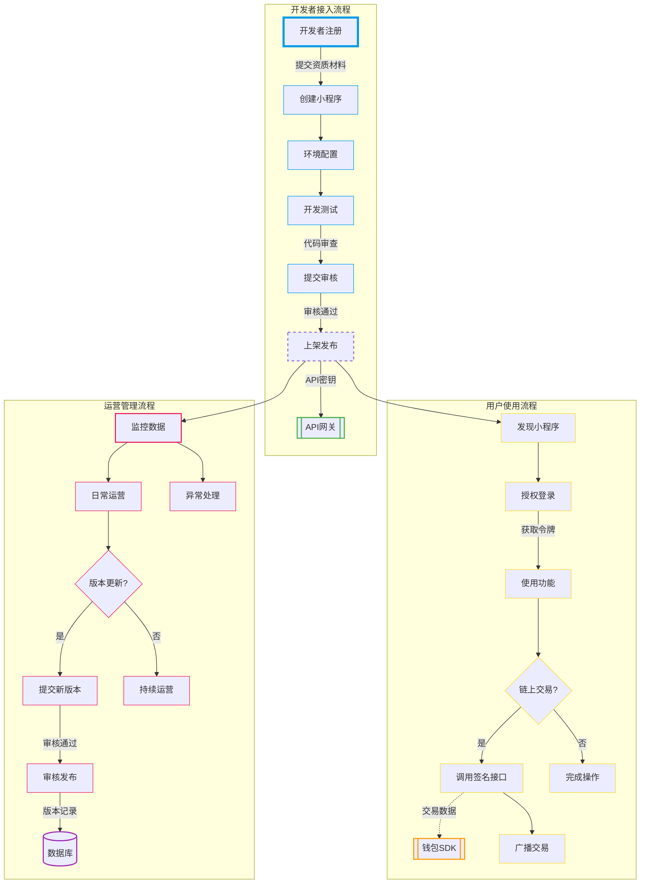

#### 3.3.1 角色职责与权限
|| 交互方式 | 数据流向 | 业务规则 |
|---|---|---|---|
| 开发者 ↔ 平台 | API调用 | 配置信息 → 平台数据库 | 需使用平台颁发的API密钥 |
| 用户 ↔ 小程序 | 钱包授权 | 用户凭证 → 小程序服务端 | 遵循OAuth 2.0协议 |
| 运营 ↔ 系统 | 管理后台 | 运营数据 ← 数据分析系统 | 数据延迟不超过5分钟 |
- 小程序开发者
  - 在无链平台注册并创建开发者账号
  - 在无链控制台管理小程序基本信息、版本和配置
  - 使用无链前端SDK开发小程序UI和交互功能
  - 使用无链后端SDK开发业务逻辑和数据处理
  - 在无链测试网进行功能测试和调试
  - 权限范围：管理自己创建的小程序，访问开发相关API

- 小程序运营者
  - 使用无链平台提供的数据分析工具
  - 监控小程序用户增长、活跃度等运营指标
  - 管理小程序内容和活动
  - 处理用户反馈和投诉
  - 权限范围：访问运营数据，管理内容和用户反馈

- 无链运营者
  - 审核和管理小程序上架申请
  - 监控平台整体运营情况
  - 处理违规小程序的下架和处罚
  - 管理平台公告和运营活动
  - 权限范围：平台级别的运营管理权限

- 无链运维者
  - 部署和更新小程序智能合约
  - 部署和维护小程序前端代码
  - 监控系统性能和安全
  - 处理技术故障和应急响应
  - 权限范围：系统级运维和部署权限

- 无链技术
  - 开发和维护小程序前端SDK
  - 开发和维护小程序后端SDK
  - 编写技术文档和开发指南
  - 提供技术支持和问题解决
  - 权限范围：SDK和技术文档的管理权限

- 无链用户
  - 在钱包中浏览和使用小程序
  - 授权小程序访问个人资源
  - 进行链上交易和支付
  - 反馈使用问题和建议
  - 权限范围：个人资源的授权管理

#### 3.3.2 角色交互关系
**核心数据流：**
1. 授权凭证流：用户 → 钱包SDK → 开放平台 → 小程序（🔐加密传输）
2. 交易数据流：小程序 → 签名服务 → 区块链节点（📡广播延迟<3s）
3. 运营数据流：监控系统 → 大数据平台 → 运营看板（📈按小时聚合）

**异常处理流程：**
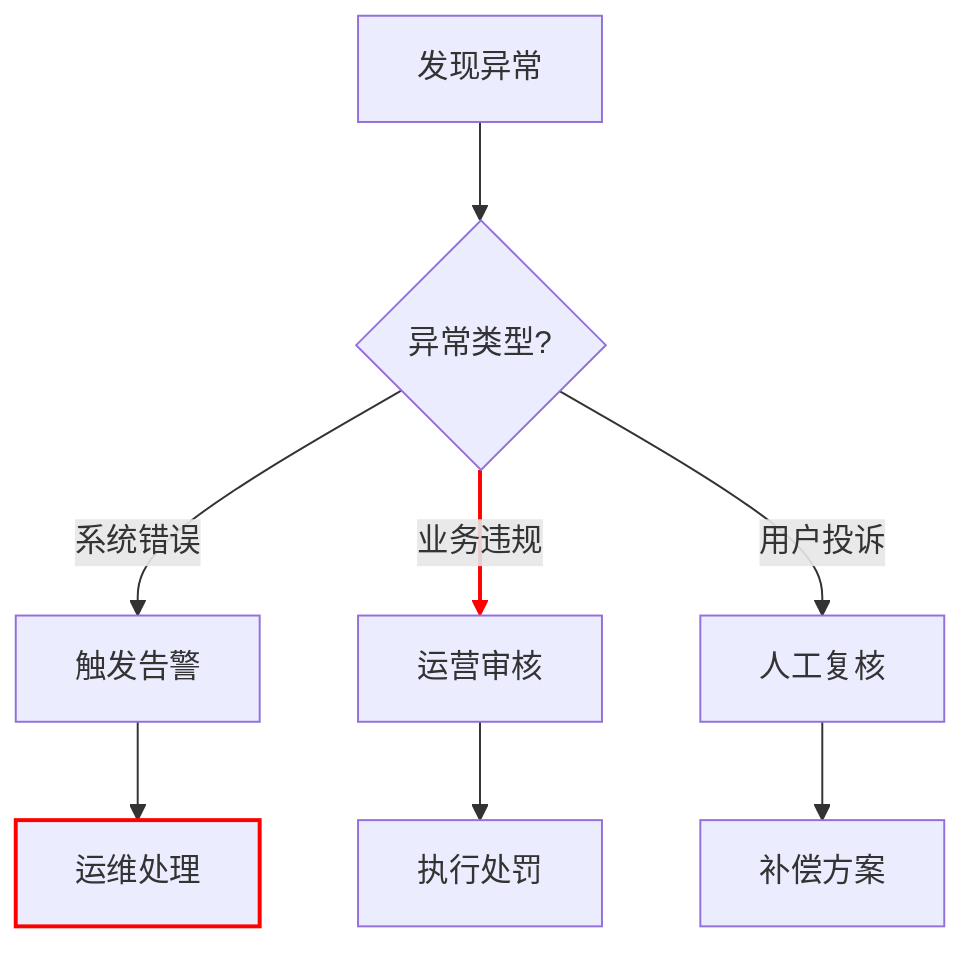
- 开发者与平台
  - 通过SDK和API与平台交互
  - 提交代码和版本更新
  - 接收平台审核反馈

- 运营者与用户
  - 收集和分析用户反馈
  - 推送运营消息和活动
  - 处理用户问题

- 技术支持与开发者
  - 提供技术咨询和支持
  - 更新SDK和文档
  - 解决技术问题

- 运维与系统
  - 监控系统状态
  - 处理部署请求
  - 维护系统安全

### 3.4 业务流程


#### 3.4.1 开发者接入流程
1. 项目方注册和认证
   - 注册无链平台开发者账号
   - 提交项目方资质认证材料
   - 等待平台审核通过

2. 开发环境配置
   - 配置小程序基本信息和参数
   - 下载前端SDK和服务端SDK
   - 获取测试环境的API密钥

3. 开发和测试
   - 在测试链环境进行开发
   - 进行功能测试和调试
   - 完成安全性测试

4. 部署和上架
   - 提交代码到指定仓库
   - 申请部署到生产环境
   - 等待运维完成部署
   - 提交上架审核申请

#### 3.4.2 用户使用流程
1. 发现和访问
   - 在无链钱包中搜索小程序
   - 查看小程序详情和说明
   - 选择打开小程序

2. 授权和登录
   - 首次使用时进行授权
   - 选择授权范围
   - 确认授权信息

3. 使用和交易
   - 正常使用小程序功能
   - 进行链上交易时
     * 调用钱包签名接口
     * 确认交易详情
     * 广播交易到链上
     * 等待交易确认

#### 3.4.3 运营管理流程
1. 日常运营
   - 监控用户数据和使用情况
   - 分析运营指标
   - 处理用户反馈

2. 版本更新
   - 提交新版本代码
   - 申请版本审核
   - 发布版本更新

3. 异常处理
   - 监控系统异常
   - 处理用户投诉
   - 执行应急预案

4. 数据分析
   - 收集用户行为数据
   - 生成运营报告
   - 优化运营策略

# chainless开放平台需求 - 业务详情

## 3.5 业务详情
### 3.5.1 小程序开发者
- 注册
- 配置
  |类型|内容|
  | ---- | ---- |
  | 基础配置 | 小程序名称、logo、域名等 |
  | 开发配置 | appid、appkey |
  | 接口配置 | 加密算法，认证算法，证书管理 |
  | 部署配置 | github开源地址|
  | 其他配置 | 审核证书 |
  | 运行管理 | |

### 3.5.2 无链运维
- 部署合约
- 部署小程序前端
- 监控检查面板

### 3.5.3 用户授权
#### 3.5.3.1 授权登录流程
##### 3.5.3.1.1 基本授权流程
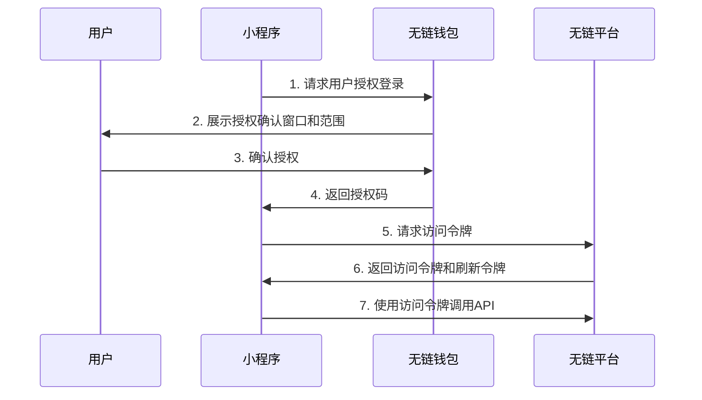

##### 3.5.3.1.2 授权失败处理

### 3.5.4 安全机制
#### 3.5.4.1 安全控制体系
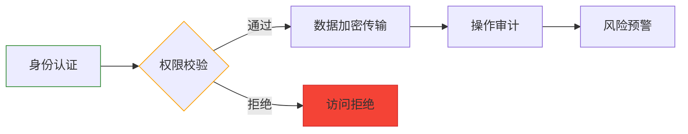

#### 3.5.4.2 安全组件
| 组件名称 | 功能描述 | 关联文档 |
|---------|--------|---------|
| 身份认证网关 | 统一认证入口 | 4.技术架构#3.5.7接口规范 |
| 权限控制中心 | 动态权限管理 | 4.技术架构#3.5.6权限控制流程 |
| 审计追踪系统 | 操作日志记录 | 5.任务和进度#6.附录 |
| 数据加密服务 | 传输存储加密 | 2.业务架构#3.3.2角色交互关系 |
- 网络异常处理
  - 实现指数退避重试机制
  - 最大重试次数限制
  - 重试间隔递增策略

- 授权错误处理
  - 授权码过期：重新发起授权流程
  - 令牌失效：使用刷新令牌更新
  - 权限不足：提示用户授予所需权限
  - 设备不匹配：清除本地授权状态重新授权

##### 3.5.3.1.3 会话管理
- 会话状态维护
  - 本地存储加密保存令牌信息
  - 定期检查令牌有效性
  - 支持多设备同时在线
  - 异常登录自动失效处理

- 令牌更新策略
  - 提前5分钟刷新即将过期的令牌
  - 刷新失败后使用备用令牌
  - 所有令牌失效后重新授权
  - 定期轮换刷新令牌

- 授权范围（Scope）
  - 基础信息：钱包地址、用户ID等
  - 扩展信息：手机号、邮箱等（需用户二次确认）
  - 交易权限：签名交易、广播交易等
  - 资产权限：查询余额、转账等

- 令牌管理
  - 访问令牌（Access Token）：短期有效，用于API访问
  - 刷新令牌（Refresh Token）：长期有效，用于更新访问令牌
  - 令牌撤销：用户可随时撤销授权

#### 3.5.3.2 安全机制
- 授权安全
  - 使用OAuth 2.0标准协议
  - PKCE（Proof Key for Code Exchange）防止授权码拦截
  - 状态参数（state）防止CSRF攻击
  - 授权码单次使用且短期有效

- 令牌安全
  - 访问令牌加密传输和存储
  - 令牌生命周期管理
  - 异常访问检测和阻断
  - 定期令牌轮换

### 3.5.4 部署管理系统
#### 3.5.4.1 系统概述
- 提供自动化部署流程，支持小程序前端和智能合约的一键部署
- 集成CI/CD流水线，实现代码提交到部署上线的全流程自动化
- 提供版本管理和回滚机制，确保系统稳定性
- 实时监控部署状态，提供告警机制
- 完善的权限控制和审计日志，保障系统安全

#### 3.5.4.2 自动化部署流程
- 代码获取
  - 支持从GitHub代码仓库自动拉取最新代码
  - 支持webhook触发自动部署
  - 支持指定分支、标签或提交ID进行部署

- 构建流程
  - 前端代码自动构建（支持React、Vue等主流框架）
  - 智能合约自动编译（支持Solidity、Rust等语言）
  - 构建环境隔离，确保构建过程安全可靠
  - 构建产物自动归档，支持历史版本查询

- 部署流程
  - 支持多环境部署（开发环境、测试环境、生产环境）
  - 支持灰度发布和蓝绿部署
  - 部署前自动执行安全检查和依赖审计
  - 部署过程可视化，实时展示部署进度和状态

### 3.5.5 沙箱测试环境
#### 3.5.5.1 系统概述
- 提供网页端沙箱环境，支持小程序的开发、调试和测试
- 模拟无链钱包运行环境，提供完整的开发调试工具链
- 支持合约调用模拟和交易模拟
- 提供数据隔离机制，确保测试数据安全

#### 3.5.5.2 功能特性
- 开发环境
  - 集成开发工具（IDE）功能
  - 实时代码编辑和预览
  - 支持断点调试和日志查看
  - 内置代码检查和格式化工具

- 调试工具
  - 网络请求监控和模拟
  - 存储数据查看和编辑
  - 页面结构和样式分析
  - 性能分析工具

- 合约调试
  - 合约部署模拟
  - 合约方法调用测试
  - 交易签名模拟
  - Gas费用估算

#### 3.5.5.3 数据模拟
- 账户系统
  - 测试账户管理
  - 多账户切换
  - 账户权限配置
  - 资产余额模拟

- API模拟
  - 钱包API接口模拟
  - 区块链节点接口模拟
  - 自定义响应配置
  - 网络延迟模拟

#### 3.5.5.4 开发流程
- 环境准备
  - 创建沙箱项目
  - 配置开发参数
  - 导入项目代码
  - 选择运行环境

- 开发调试
  - 代码实时编辑
  - 页面实时预览
  - 接口调试
  - 问题诊断

- 测试验证
  - 功能测试
  - 性能测试
  - 兼容性测试
  - 安全性测试


# chainless开放平台需求 - 技术架构

## 3. 技术
### 3.1 软件结构

#### 3.1.0 系统架构图
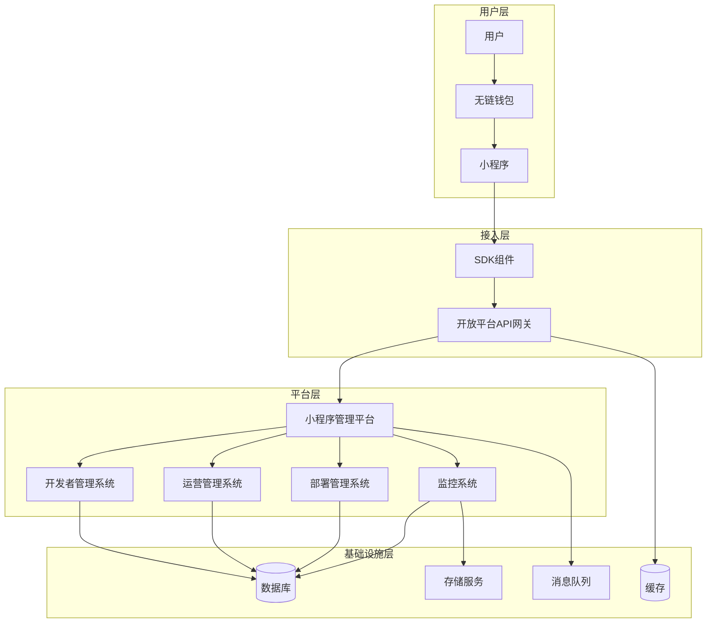

#### 3.1.1 整体架构
- 小程序运行环境
  - 无链钱包使用webview运行小程序，小程序以HTML5格式呈现
  - 小程序运行时隔离，确保安全性
  - 支持离线缓存和热更新

#### 3.1.2 核心组件
- 小程序管理平台
  - 开发者管理系统
    - 开发者账户管理
      - 注册与认证流程
      - 资质审核
      - 账户安全设置
    - 应用管理
      - 创建与配置
      - 版本管理
      - 发布流程
    - API密钥管理
      - 密钥生成
      - 权限配置
      - 使用统计
    - 开发工具
      - SDK下载
      - 文档中心
      - 调试工具
  - 运营管理系统
    - 核心功能模块
      - 内容审核管理
        * 小程序审核流程
        * 内容质量评估
        * 违规处理
        * 审核记录追踪
      - 用户管理
        * 用户数据分析
        * 行为监控
        * 风险控制
        * 用户反馈处理
      - 数据分析
        * 使用量统计
        * 性能监控
        * 异常分析
        * 趋势报告
      - 运营配置
        * 功能开关管理
        * 参数配置
        * 公告管理
        * 活动管理

    - 数据流程
      - 审核流程
        1. 接收审核请求 -> 分配审核人员
        2. 审核评估 -> 生成审核报告
        3. 审核决策 -> 执行处理措施
        4. 反馈通知 -> 更新审核状态
      - 运营分析流程
        1. 数据采集 -> 清洗处理
        2. 指标计算 -> 生成报表
        3. 异常检测 -> 预警通知
        4. 策略调整 -> 效果跟踪
  - 部署管理系统
    - 核心功能模块
      - 环境管理
        * 开发环境配置
        * 测试环境管理
        * 生产环境控制
        * 资源配额管理
      - 配置管理
        * 应用配置模板
        * 环境变量管理
        * 密钥证书管理
        * 配置版本控制
      - 部署流程
        * 代码构建打包
        * 自动化部署
        * 版本回滚
        * 灰度发布
      - 监控告警
        * 服务健康检查
        * 性能指标监控
        * 日志收集分析
        * 告警规则配置

    - 数据流程
      - 部署流程
        1. 代码提交 -> 触发自动构建
        2. 构建打包 -> 生成部署包
        3. 环境准备 -> 配置注入
        4. 部署验证 -> 服务启动
      - 监控流程
        1. 指标采集 -> 数据存储
        2. 规则匹配 -> 触发告警
        3. 告警通知 -> 处理响应
        4. 状态更新 -> 闭环跟踪
  - 监控系统
    - 核心功能模块
      - 性能监控
        * 系统资源监控
        * 接口响应时间
        * 业务指标跟踪
        * 容量规划分析
      - 日志管理
        * 日志收集
        * 实时检索
        * 日志分析
        * 审计追踪
      - 告警系统
        * 告警规则配置
        * 告警级别管理
        * 告警通知渠道
        * 告警升级策略
      - 数据分析
        * 趋势分析
        * 异常检测
        * 报表生成
        * 数据可视化

    - 数据流程
      - 数据采集流程
        1. 埋点数据收集 -> 数据清洗
        2. 指标计算 -> 数据存储
        3. 实时分析 -> 触发告警
        4. 数据展示 -> 生成报表
      - 告警处理流程
        1. 告警触发 -> 规则匹配
        2. 告警分发 -> 通知相关人员
        3. 问题处理 -> 状态更新
        4. 事件复盘 -> 优化告警规则

- SDK组件
  - 前端SDK
    * UI组件库：提供符合平台设计规范的界面组件
    * 授权模块：处理用户登录和权限管理
    * 支付接口：集成无链钱包支付能力
    * 存储模块：提供本地数据缓存能力
    * 网络模块：封装API调用和数据传输
    * 事件系统：提供组件间通信机制
  - 后端SDK
    * 智能合约交互：封装合约调用接口
    * 数据存储服务：提供云端数据存储能力
    * 用户管理：处理用户身份和权限
    * 消息推送：提供实时通知能力
    * 分析统计：收集使用数据和性能指标

- 开放平台API网关
  - 统一接入层
    * 协议转换：支持HTTP/HTTPS/WebSocket
    * 请求路由：根据服务类型分发请求
    * 版本管理：支持多版本API并存
  - 流量控制
    * 限流策略：基于应用和用户的请求限制
    * 负载均衡：请求分发到多个服务实例
    * 熔断降级：异常情况下保护系统稳定
  - 安全防护
    * 身份认证：验证请求合法性
    * 权限控制：检查操作权限
    * 数据加密：保护敏感信息
    * 攻击防御：抵御常见Web攻击
  - 服务编排
    * 请求聚合：合并多个后端服务调用
    * 数据转换：处理请求和响应格式
    * 缓存策略：优化频繁访问数据

### 3.2 安全要求
#### 3.2.1 用户安全
- 用户登录
  - 支持多因素认证
  - 防暴力破解
  - 异常登录检测

- 用户授权
  - 基于OAuth2.0协议
  - 细粒度权限控制
  - 授权范围明确可见
  - 支持授权撤销

- 钱包交易签名
  - 多重签名支持
  - 交易限额控制
  - 异常交易检测
  - 签名信息防篡改

#### 3.2.2 平台安全
- 代码安全
  - 源码审计
  - 漏洞扫描
  - 依赖检查

- 运行时安全
  - 沙箱隔离
  - 资源限制
  - 实时监控

- 数据安全
  - 传输加密
  - 存储加密
  - 访问控制

### 3.3 数据结构
#### 3.3.1 小程序基础信息
```json
{
  "appId": "string",          // 小程序唯一标识
  "name": "string",          // 小程序名称
  "version": "string",       // 版本号
  "description": "string",   // 描述
  "icon": "string",         // 图标URL
  "developer": {            // 开发者信息
    "id": "string",
    "name": "string",
    "email": "string"
  },
  "permissions": ["string"], // 权限列表
  "contracts": [{           // 关联的智能合约
    "address": "string",
    "name": "string",
    "abi": "object"
  }]
}
```

#### 3.3.2 用户授权信息
```json
{
  "userId": "string",        // 用户ID
  "appId": "string",        // 小程序ID
  "scope": ["string"],      // 授权范围
  "expireTime": "number",   // 过期时间
  "refreshToken": "string", // 刷新令牌
  "createTime": "number"    // 创建时间
}
```

### 3.4 数据库设计
#### 3.4.1 小程序信息表(mini_programs)
| 字段名 | 类型 | 说明 |
|--------|------|------|
| app_id | varchar(32) | 主键，小程序ID |
| name | varchar(64) | 小程序名称 |
| version | varchar(16) | 版本号 |
| description | text | 描述信息 |
| icon_url | varchar(256) | 图标地址 |
| developer_id | varchar(32) | 开发者ID |
| status | tinyint | 状态(0:开发中,1:审核中,2:已上线,3:已下架) |
| create_time | timestamp | 创建时间 |
| update_time | timestamp | 更新时间 |

#### 3.4.2 用户授权表(user_authorizations)
| 字段名 | 类型 | 说明 |
|--------|------|------|
| id | varchar(32) | 主键 |
| user_id | varchar(32) | 用户ID |
| app_id | varchar(32) | 小程序ID |
| scope | json | 授权范围 |
| access_token | varchar(128) | 访问令牌 |
| refresh_token | varchar(128) | 刷新令牌 |
| expire_time | timestamp | 过期时间 |
| create_time | timestamp | 创建时间 |
| update_time | timestamp | 更新时间 |

### 3.6 系统组件
#### 3.6.1 数据流
- 开发者注册流程
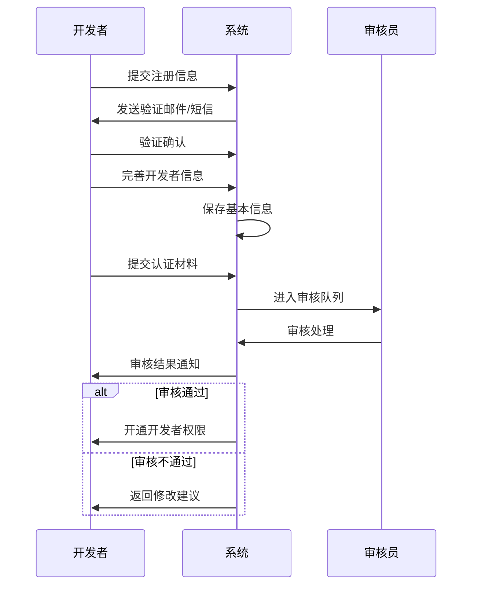

- 应用发布流程
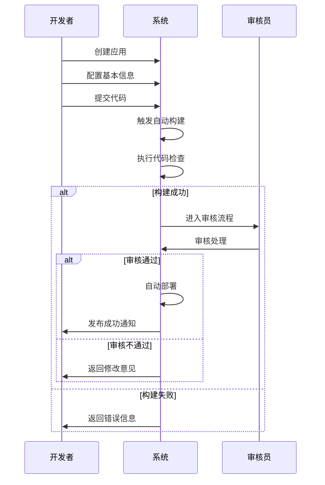

#### 3.5.4 用户授权流程

#### 3.5.6 权限控制流程
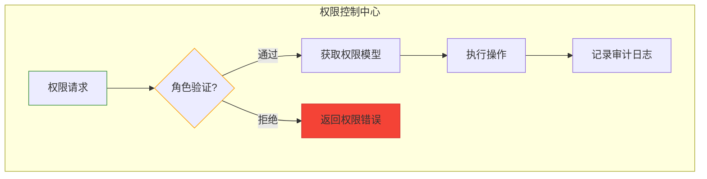

#### 3.5.7 接口规范
| 接口名称 | 方法 | 权限要求 | 频率限制 |
|---------|------|---------|---------|
| /api/v1/permission/verify | POST | 有效访问令牌 | 100次/分钟 |
| /api/v1/permission/roles | GET | 管理员权限 | 10次/分钟 |
| /api/v1/permission/sync | POST | 系统级权限 | 5次/分钟 |
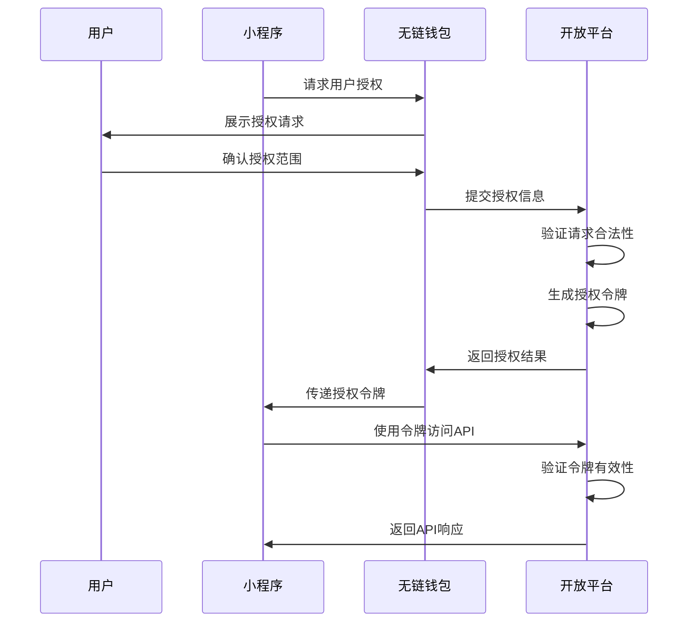

#### 3.5.5 交易签名流程
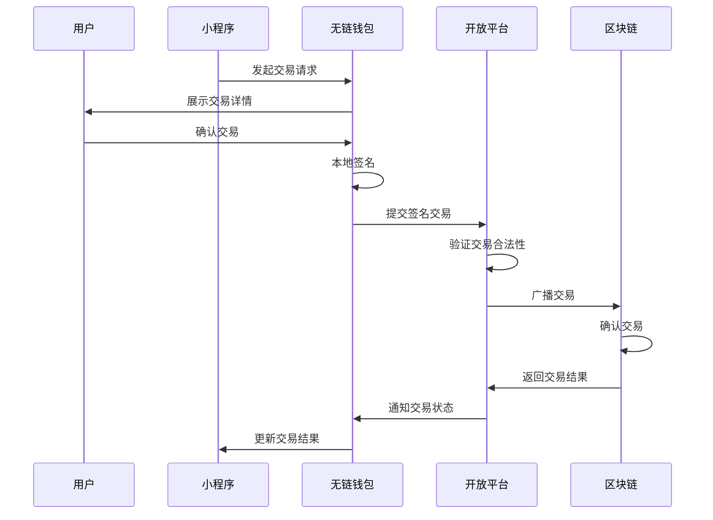


# chainless开放平台需求 - 任务和进度

## 4. 任务
|序号|任务|依赖|说明|完成时间|
| ---- | ---- | ---- | ---- | ---- |
| MPT-01 | 撰写标准合约 | | CRC20/CRC721/CRC115 | |
| MPT-02 | 无链平台支持认证授权 | | | |
| MPT-03 | 小程序框架 |MPT-02 | - 开发者<br> - 运营<br> - 控制<br> - 检索| |
| MPT-04 | 小程序开发者web端 |MPT-03 | | |
| MPT-05 | 小程序运营者web端 |MPT-03 | | |
| MPT-06 | openapi |MPT-03| | |
| MPT-07 | 前端SDK |MPT-06 | | |
| MPT-08 | 后端SDK |MPT-06 | | |
| MPT-09 | 自动部署小程序 |MPT-03 | | |
| MPT-10 | 无链运营 |MPT-03 | | |
| MPT-11 | 小程序开发文档 |MPT-01| | |


## 5. 进度
- 明确整理需求
- 软件设计
- 实现MVP业务<br>
以上满足内部使用，使用现有小程序迁移到当前框架测试
- 实现web管理
- 实现小程序自动部署
- 实现运营管理<br>
以上完成所有可对外使用的版本

## 6. 附录
### 开放平台业务规则
- dapp链上交易要求必须消费用户的dw20等资产作为交易手续费
- 未购买无链平台支付服务的小程序链上交易要求必须消费用户的dw20等资产作为交易手续费（详见[交易广播规则](../4.技术架构.md#354-交易广播规则)）
- 购买了无链平台支付服务的小程序链上交易将由无链平台代付交易手续费
- 所有小程序将免费享受无链平台提供的免费服务，如消息通知（如与私米打通，直接通知到私米对应群里面）（参考[开发者服务条款](../3.业务详情.md#354-开发者服务条款)）
- 无链平台也将提供付费服务（参见[权限控制流程](../4.技术架构.md#356-权限控制流程)）


# 部署管理系统

## 1. 核心功能模块

### 1.1 环境管理
- 多环境配置
  - 开发环境沙箱机制
  - 测试环境自动回收策略
  - 生产环境权限隔离
- 资源配额管理

### 1.2 配置管理
- 统一配置中心
  - 配置加密存储
  - 版本历史追溯
  - 实时生效机制
- 密钥管理
  ```mermaid
  flowchart LR
    A[生成密钥] --> B[加密存储]
    B --> C[访问审计]
    C --> D[自动轮换]
  ```

### 1.3 部署流程
- 自动化流水线
  - 代码扫描 → 单元测试 → 构建打包
  - 蓝绿部署策略
  - 回滚机制（5分钟阈值）
- 监控告警集成
  - 部署状态实时看板
  - 异常部署自动中止

## 2. 安全架构
- 部署签名验证
  - 代码哈希校验
  - 数字签名验证链
  - 运行时完整性检查
- 访问控制
  - 最小权限原则
  - 双因素认证

## 3. 系统集成
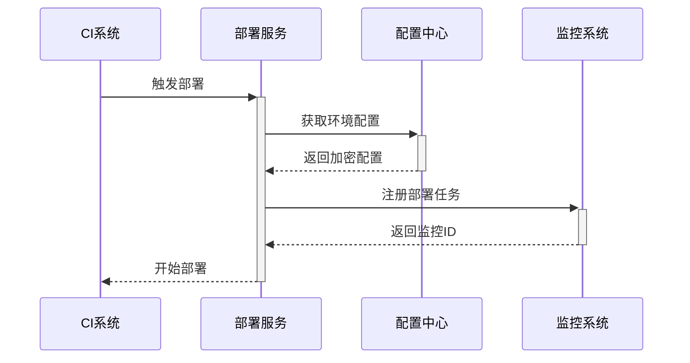

# 监控系统

## 1. 核心功能模块

### 1.1 性能监控
- 系统资源监控
  - CPU/内存使用率实时追踪
  - 磁盘IO性能指标
  - 网络带宽监控
- 接口响应时间
  - API平均响应时间统计
  - P95/P99延迟分析

### 1.2 日志管理


### 1.3 告警系统
- 多级告警策略
  ```json
  {
    "alert_levels": [
      {"level": "紧急", "threshold": 95},
      {"level": "严重", "threshold": 85},
      {"level": "警告", "threshold": 75}
    ]
  }
  ```

## 2. 数据处理流程
### 2.1 数据采集流程
1. 埋点数据收集 -> 数据清洗
2. 指标计算 -> 数据存储
3. 实时分析 -> 触发告警
4. 数据展示 -> 生成报表

### 2.2 告警处理流程
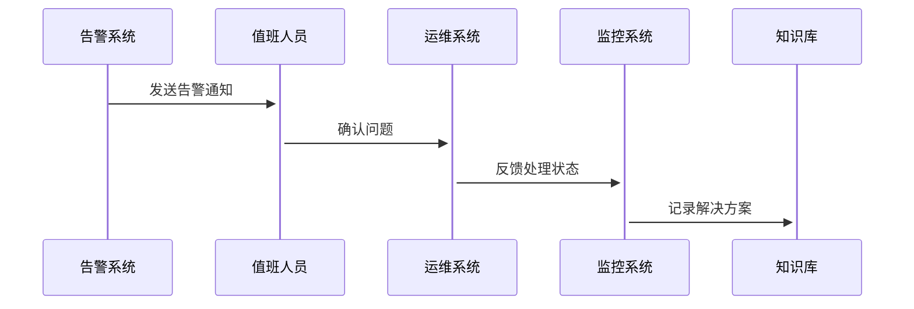

## 3. 系统集成
- 与部署管理系统对接部署状态监控
- 与运营管理系统共享运营指标
- 与开发者管理系统联动API监控数据


# 开发者管理系统

## 1. 核心功能模块

### 1.1 开发者账户管理
- 注册与认证流程
  - 多因素身份验证机制
  - 资质文件自动校验
- 账户安全设置
  - 密码策略管理（复杂度、有效期）
  - 登录失败锁定机制

### 1.2 应用管理
- 全生命周期管理
  ```mermaid
  flowchart TB
    A[创建应用] --> B[开发测试]
    B --> C[提交审核]
    C --> D{审核通过?}
    D -->|是| E[生产部署]
    D -->|否| F[返回修改]
  ```
- 版本控制策略
  - 语义化版本规范（major.minor.patch）
  - 热更新灰度发布机制

### 1.3 API密钥管理
- 密钥生命周期管理
  - 自动轮换策略（90天强制更新）
  - 密钥吊销清单（CRL）
- 细粒度权限控制
  ```json
  {
    "api_key": "KEY_123",
    "scopes": [
      "data:read",
      "transaction:write"
    ],
    "rate_limit": {
      "calls": 1000,
      "per": "hour"
    }
  }
  ```

## 2. 安全架构
- 基于角色的访问控制（RBAC）
- 审计日志记录规范
  - 关键操作日志留存≥180天
- 自动化安全扫描
  - SAST/DAST集成流水线

## 3. 系统集成
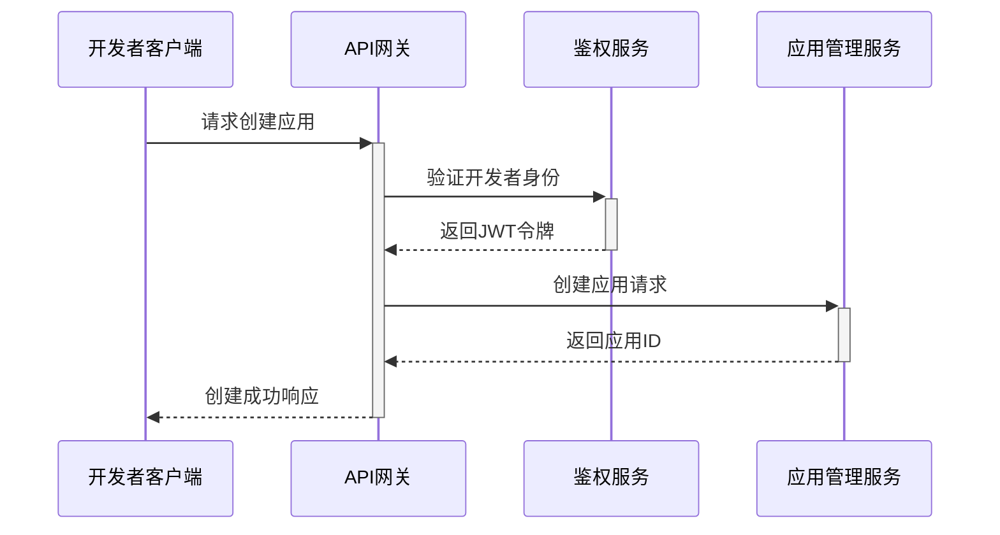

# 运营管理系统

## 1. 核心功能模块

### 1.1 内容审核管理
- 小程序审核流程
  - 自动化初审机制
  - 人工复核流程
- 内容质量评估
  ```mermaid
  flowchart LR
    A[内容采集] --> B[机器过滤]
    B --> C{可疑内容?}
    C -->|是| D[人工审核]
    C -->|否| E[自动通过]
  ```

### 1.2 用户管理
- 用户行为分析
  - 实时行为轨迹追踪
  - 风险评分模型
- 反馈处理机制
  - 工单分类处理
  - SLA响应时限控制

### 1.3 数据分析
- 多维数据看板
  ```json
  {
    "metrics": [
      "DAU",
      "留存率",
      "转化率"
    ],
    "timeRange": {
      "start": "2024-01-01",
      "end": "2024-03-31"
    }
  }
  ```

## 2. 安全控制
- 数据脱敏策略
  - 实时数据掩码处理
  - 访问日志审计
- 权限分级管理
  - 角色权限矩阵
  - 操作日志留存

## 3. 系统集成
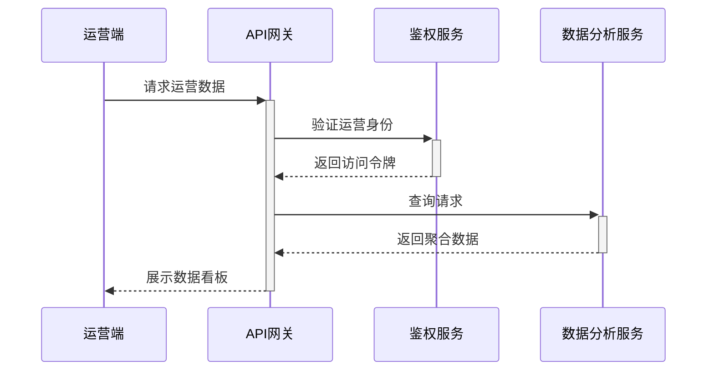
