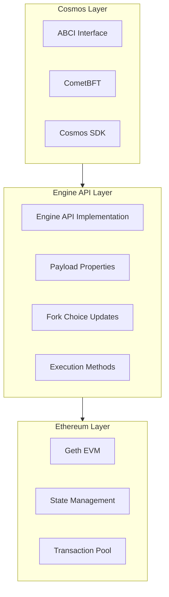
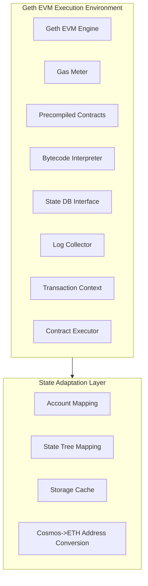
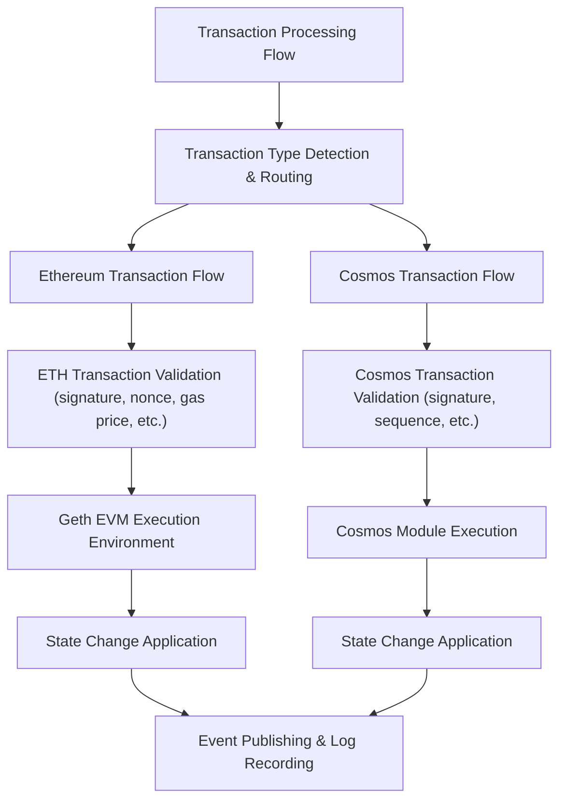
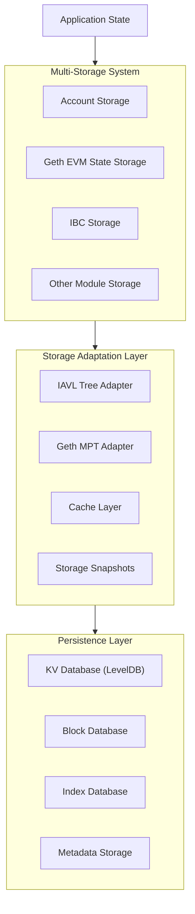

# Cosmos-EVM Integration Technical Implementation Plan

## 1. Executive Summary

This document provides a detailed technical implementation plan for integrating Geth EVM into Cosmos SDK via the Ethereum Engine API. The solution aims to create a blockchain platform that combines Cosmos interoperability with Ethereum smart contract functionality, achieving modular integration through the standardized Engine API.

## 2. System Architecture

### 2.1 Overall Architecture

```mermaid
flowchart TB
    CA["Client Applications & dApps"] --> EI
    
    subgraph EI["External Interface Layer"]
        CG["Cosmos RPC (gRPC)"]
        EJ["Ethereum JSON-RPC Compatible Interface"]
        CT["Command Line Tools"]
        RA["REST API Interface"]
    end
    
    EI --> AP
    
    subgraph AP["Application Processing Layer"]
        TP["Transaction Processing"]
        QP["Query Processing"]
        BP["Block Processing"]
        MP["Message Processing"]
    end
    
    AP --> ME
    
    subgraph ME["Module Execution Layer"]
        EM["Geth EVM Module"]
        NM["Cosmos Native Modules"]
        IM["IBC Module"]
        CM["Custom Business Modules"]
    end
    
    ME --> SM
    
    subgraph SM["State Management Layer"]
        SS["State Storage"]
        ST["State Transition"]
        SV["State Validation"]
        SI["State Indexing"]
    end
    
    SM --> PL
    
    subgraph PL["Persistence Layer"]
        KVS["KV Storage"]
        MPS["Geth MPT Storage"]
        BS["Block Storage"]
        IDB["Index Database"]
    end
    
    PL --> CN
    
    subgraph CN["Consensus & Network Layer"]
        CB["CometBFT Consensus Engine"]
        PN["P2P Network"]
        MP["Mempool"]
        SY["Synchronization Mechanism"]
    end
```

### 2.2 Engine API Layer Architecture

## 3. Core Component Design

### 3.1 EVM Execution Environment

### 3.2 Transaction Processing Flow

### 3.3 State Storage System

## 4. Implementation Details

### 4.1 Engine API Implementation
   - Engine API Interface Definition
   - Engine API Implementation

### 4.2 State Adapter Implementation
   - StateDB Adapter
   - MPT Adapter

### 4.3 Transaction Processing Implementation
   - Transaction Routing Processing
   - Transaction Signature Verification

### 4.4 RPC Interface Implementation

## 5. Implementation Steps (Estimated)

### 5.1 Phase One: Infrastructure Setup (8 weeks)

1. Initialize Cosmos SDK Application Architecture
   - Create Basic Module Structure
   - Implement ABCI Interface
   - Set up Storage Keys and Parameters

2. Integrate Geth EVM Execution Engine
   - Import Geth EVM Related Code
   - Implement Basic EVM Execution Environment
   - Create Engine API Interface Layer

3. Implement Basic State Storage Adaptation
   - Implement StateDB Interface
   - Create MPT Adapter
   - Connect to Cosmos KVStore

4. Implement Engine API Endpoints
   - Develop NewPayloadV1 Method
   - Develop ForkchoiceUpdatedV1 Method
   - Implement Transaction Pool Management Interface

5. Build Initial Transaction Processing Flow
   - Implement Transaction Detection and Routing
   - Develop Basic AnteHandler

### 5.2 Phase Two: Feature Development (12 weeks)

1. Enhance Geth EVM Execution Environment
   - Complete Implementation of Precompiled Contracts
   - Support Ethereum Virtual Machine Instruction Set
   - Refine State Transition Logic

2. Implement Account System Mapping
   - Develop Cosmos and Ethereum Account Mapping
   - Implement Nonce Management and Balance Tracking
   - Support Contract Account Management

3. Develop RPC Interfaces
   - Implement Ethereum JSON-RPC Standard Interfaces
   - Develop WebSocket Event Subscriptions
   - Support Filters and Log Queries

4. Integrate Event System
   - Implement Log Collector
   - Develop Event Indexing
   - Connect to Cosmos Event System

### 5.3 Phase Three: Integration and Testing (6 weeks)

1. IBC Module Integration
   - Support Cross-Chain Asset Transfer
   - Implement IBC and EVM Asset Interoperability

2. Interoperability Development
   - Implement Interoperability with Other Cosmos Modules
   - Support Governance and Proof of Stake Mechanisms

3. Performance Optimization
   - Implement State Caching Mechanism
   - Optimize Storage Access Paths
   - Adjust Gas Measurement and Limits

4. Security Audit
   - Conduct Code Audit
   - Fix Discovered Vulnerabilities
   - Strengthen Permission Controls

### 5.4 Phase Four: Deployment and Launch (4 weeks)

1. Testnet Deployment
   - Deploy Testnet Nodes
   - Monitor Network Operational Status
   - Collect Initial Performance Data

2. Community Testing
   - Release Developer Tools
   - Organize Community Testing Activities
   - Collect Feedback and Improve

3. Documentation Refinement
   - Write Technical Documentation
   - Create Developer Guides
   - Publish API Reference Documentation

4. Mainnet Preparation
   - Final Performance Tuning
   - Security Checks
   - Deployment and Launch Planning

## 6. Risk Management

### 6.1 Identified Risks

| Risk Category | Risk Description | Impact Level | Mitigation Measures |
|----------|----------|----------|----------|
| Technical Risk | Geth EVM State Incompatible with Cosmos Storage | High | Comprehensive Testing of State Adapters, Implement Rollback Mechanisms |
| Performance Risk | Geth EVM Execution Impacts Block Production Time | Medium | Adjust Gas Limits, Optimize Storage Access |
| Security Risk | Smart Contract Vulnerabilities Threaten Chain Security | High | Implement Security Analysis Tools, Limit Contract Permissions |
| Upgrade Risk | Network Upgrades Cause State Inconsistencies | Medium | Design Detailed Upgrade Paths, Provide Testnet Validation |
| Compatibility Risk | Inability to Support Certain Geth EVM Features | Low | Clearly Document Feature Limitations, Provide Alternatives |

## 7. Conclusions and Recommendations

Based on the analysis of various implementation paths, it is recommended to adopt the solution of integrating the latest version of Geth EVM through the Ethereum Engine API, combined with the flexibility of Cosmos SDK, to build a blockchain platform that leverages advantages from both ecosystems. This approach balances development complexity with feature completeness, providing a clear path to achieve deep integration between Geth EVM and Cosmos SDK.

It is recommended that the project team first build a Minimum Viable Product (MVP) to validate core functionality, then gradually expand features and optimize performance. At the same time, closely monitor developments in both Ethereum and Cosmos ecosystems, adjusting technical solutions in a timely manner to adapt to future changes.
