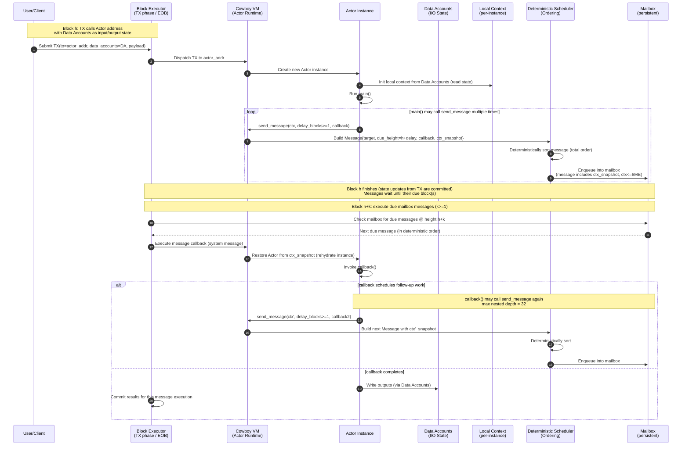

```mermaid
sequenceDiagram
    autonumber
    participant U as User/Client
    participant EX as Block Executor<br/>(TX phase / EOB)
    participant VM as Cowboy VM<br/>(Actor Runtime)
    participant AI as Actor Instance
    participant DA as Data Accounts<br/>(I/O State)
    participant CTX as Local Context<br/>(per-instance)
    participant SCH as Deterministic Scheduler<br/>(Ordering)
    participant MB as Mailbox<br/>(persistent)

    Note over U,EX: Block h: TX calls Actor address<br/>with Data Accounts as input/output state

    U->>EX: Submit TX(to=actor_addr, data_accounts=DA, payload)
    EX->>VM: Dispatch TX to actor_addr
    VM->>AI: Create new Actor instance
    AI->>CTX: Init local context from Data Accounts (read state)
    AI->>AI: Run main()

    loop main() may call send_message multiple times
        AI->>VM: send_message(ctx, delay_blocks>=1, callback)
        VM->>SCH: Build Message{target, due_height=h+delay, callback, ctx_snapshot}
        SCH->>SCH: Deterministically sort message (total order)
        SCH->>MB: Enqueue into mailbox<br/>(message includes ctx_snapshot, ctx<=8MB)
    end

    Note over EX,MB: Block h finishes (state updates from TX are committed)<br/>Messages wait until their due block(s)

    Note over EX,MB: Block h+k: execute due mailbox messages (k>=1)

    EX->>MB: Check mailbox for due messages @ height h+k
    MB-->>EX: Next due message (in deterministic order)
    EX->>VM: Execute message callback (system message)
    VM->>AI: Restore Actor from ctx_snapshot (rehydrate instance)
    AI->>AI: Invoke callback()

    alt callback schedules follow-up work
        Note over AI,MB: callback() may call send_message again<br/>max nested depth = 32
        AI->>VM: send_message(ctx', delay_blocks>=1, callback2)
        VM->>SCH: Build next Message with ctx'_snapshot
        SCH->>SCH: Deterministically sort
        SCH->>MB: Enqueue into mailbox
    else callback completes
        AI->>DA: Write outputs (via Data Accounts)
        EX->>EX: Commit results for this message execution
    end

```
