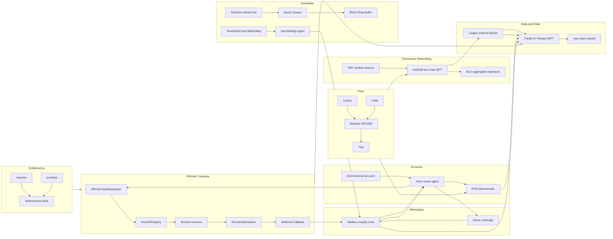

```mermaid
flowchart LR
  subgraph C[Consensus Networking]
    VRF[VRF random beacon]
    HS[HotStuff two chain BFT]
    BLS[BLS aggregated signature]
    VRF --> HS --> BLS
  end

  subgraph D[Data and State]
    L[Ledger ordered blocks]
    TDB[Triedb KV Hexary MPT]
    AUX[Aux index rebuild]
    L --> TDB
    TDB --> AUX
  end

  subgraph S[Accounts]
    EOA[EOA external account]
    ACT[Actor smart agent]
    PVM[PVM deterministic]
    EOA --> ACT
    ACT --> PVM
  end

  subgraph M[Messaging]
    MSG[Async message]
    MB[Mailbox exactly once]
    ACT --> MSG --> MB --> ACT
  end

  subgraph T[Scheduler]
    TQ1[Block Ring Buffer]
    TQ2[Epoch Queue]
    TQ3[Overflow Sorted Set]
    GBA[Gas Bidding Agent]
    TW[TimeWheel and WatchMap]
    TQ3 --> TQ2 --> TQ1
    TW --> GBA --> MB
  end

  subgraph O[Offchain Compute]
    DISP[OffchainTaskDispatcher]
    REG[RunnerRegistry]
    RUN[Runner executor]
    SUB[RunnerSubmission]
    DEFER[Deferred Callback]
    ACT --> DISP
    DISP --> REG
    REG --> RUN --> SUB --> DEFER --> MB --> ACT
  end

  subgraph E[Entitlements]
    REQ[requires]
    PROV[provides]
    ENF[enforcement audit]
    REQ --> ENF
    PROV --> ENF
  end

  subgraph F[Fees]
    CYC[Cycles]
    CEL[Cells]
    BF[Basefee EIP1559]
    TIP[Tips]
    CYC --> BF --> TIP
    CEL --> BF
  end

  HS --> L
  L --> TDB
  PVM --> TDB
  MB --> TDB
  O --> TDB
  E --> O
  F --> HS
  F --> PVM

```
